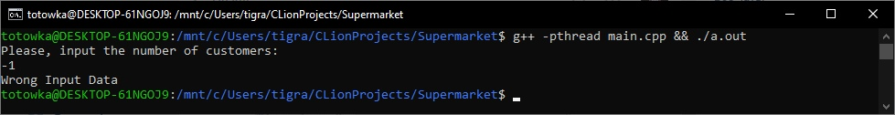
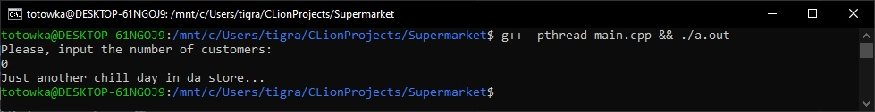
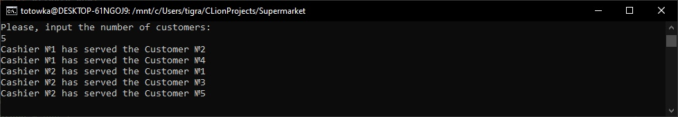

# Многопоточное приложение для симуляции работы супермаркета.
## Выполнил студент БПИ199 Кочарян Тигран Самвелович <tskocharyan@edu.hse.ru>.
---

## Описание работы программы:

* Пользователь вводит число N - целочисленное количество покупателей >= 0.

* Затем программа создает N потоков клиентов, `semaphore` которых добавляет в очередь `queue`.

* Затем программа создает 2 потока кассиров для каждой очереди, которые обслуживают покупателей внутри очередй по порядку.

* После обслуживания, с помощью `mutex` программа уменьшает количество покупателей в очереди и выводит в консоль сообщение формата:
  + _Кассир №m обслужил Клиента №n_.

## Подробнее описано в ПЗ задания.
---

## Примеры работы кода:
#### Скриншот 1. Некорректное (отрицательное) значение количества клиентов.  Вывод сообщения об ошибке..

#### Скриншот 2. Ввод количества клиентов равному 0. Сообщение о завершении работы магазина на сегодня.

#### Скриншот 3. Ввод количества клиентов равного 5. Разделение клиентов по потокам и их обслуживание.

#### Скриншот 4. Повторный ввод количества клиентов равного 5. Разделение клиентов по потокам и их обслуживание. Заметим, что клиенты разделились по другим очередям и обслуживались отлично от того, как это было в прошлом примере.

---

## [Контакты.](https://vk.com/k_tigran)
